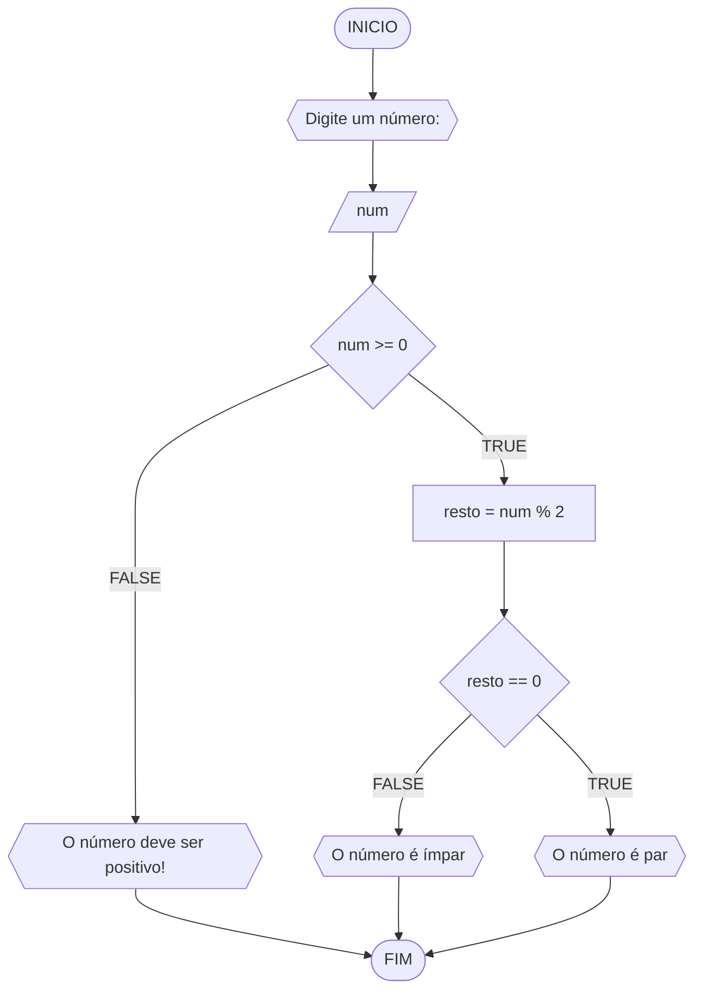

# UNIFOR 
**Nome** : Carlyle Martins <br>
**Disciplina** : Raciocínio Lógico e Algoritmo 

## Lista de exercícios 1

### Exercícios 3
represente, em um fluxograma e pseudocódigo num algaritmo para  determinar  se um número  inteiro e positivo é par ou impar

###Fluxograma
 
 

#### PSEUDOCÓDIGO
````
ALGORITMO verifica_par_impar
DECLARE num, resto: INTEIRO
INICIO
ESCREVA "Digite um número: "
LEIA num 
SE num > 0 ENTAO
	resto <- num % 2
	SE resto == 0 ENTAO
		ESCREVA "O número é par!"
	SENAO
		ESCREVA "O número é impar!"
	FIM_SE
SENAO 
	ESCREVA "O número deve ser positivo!"
FIM_SE
FIM
````

####Teste
| num | num >= 0 | resto | resto == 0 | saída |
| -- | -- | -- | -- | -- |
| -1 | False | | |"o número deve ser positivo"|
| 0 | True | 0 | True | "o número é par" |
| 11 | True | 1 | False | "o número é impar"
