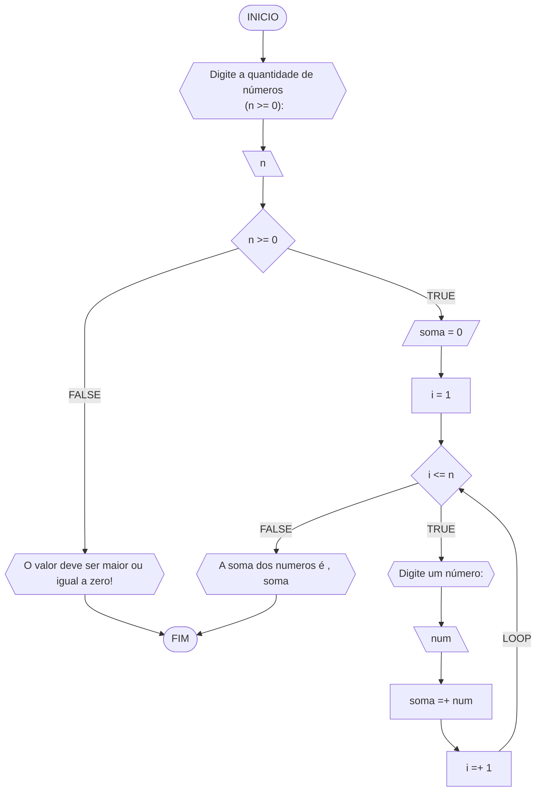
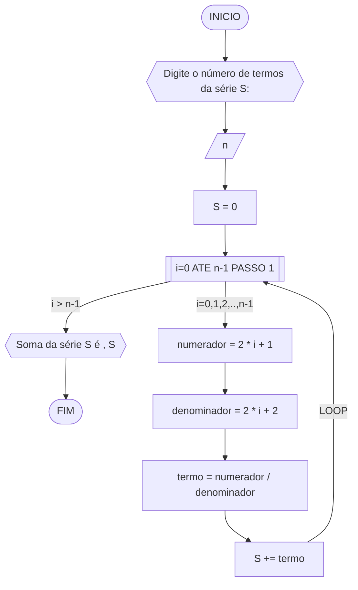
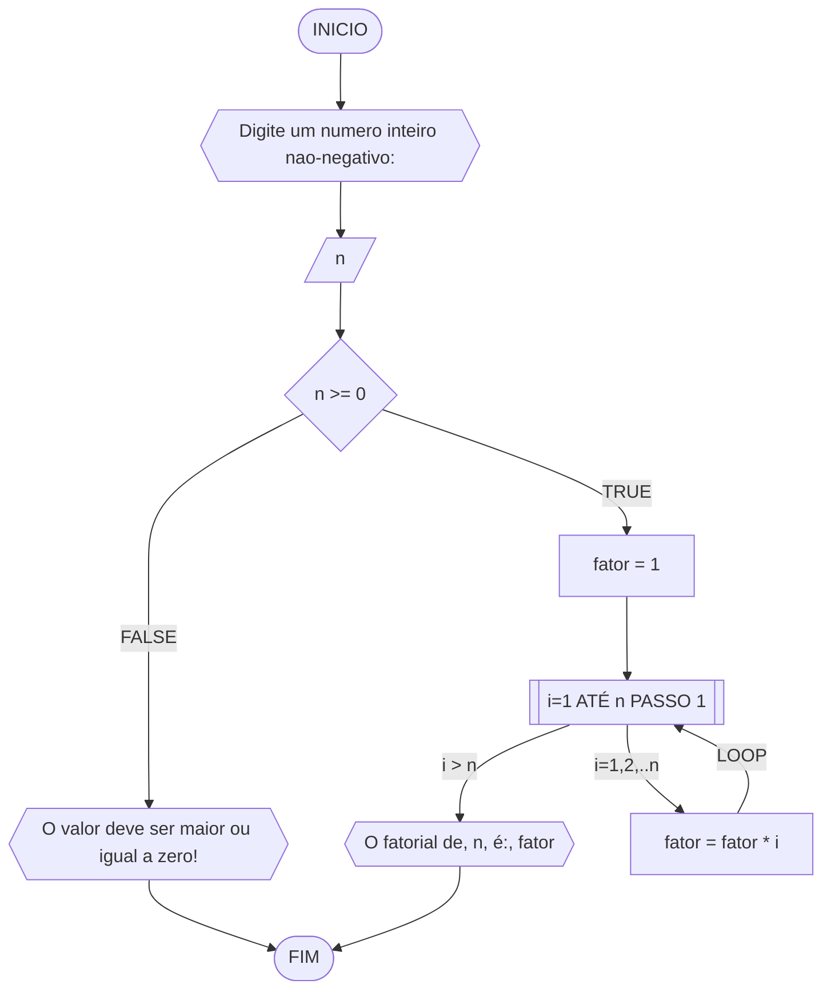
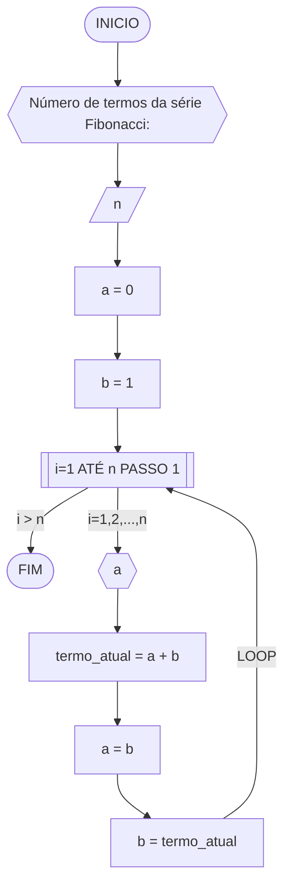
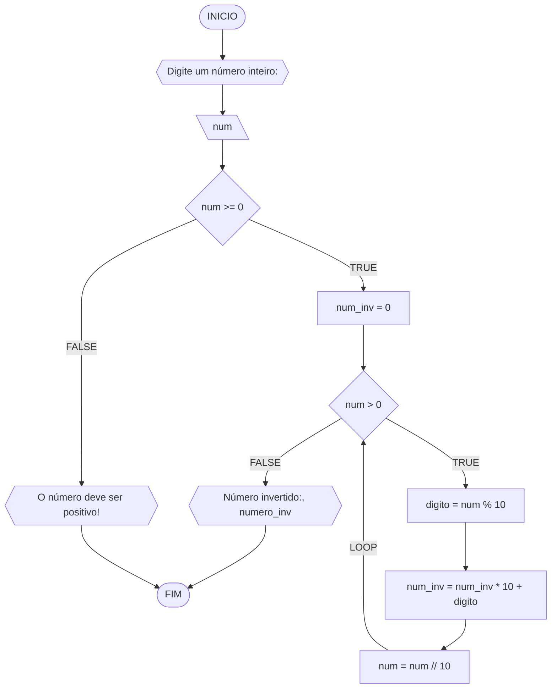

**Curso:** Engenharia da Computação <br>
**Disciplina:** Raciocínio Logico e algoritmo <br>
**Código/Turma:** preencha com seus dados <br>
**Professor:** Ricardo Carubbi <br>
**Data:** preencha com a data de envio <br>
**Aluno(a):** Carlyle Martins <br>
**Matrícula:** 2410305 <br>

**1a chamada (Sim/Não):** Não <br>
**2a chamada (Sim/Não):** Sim <br>

# Avaliação Diagnóstica 1

## Normas e exigências

Avaliação diagnóstica (**AD**) consiste em exercícios ou projetos desenvolvidos em grupo ao longo da disciplina. <br>
A primeira avaliação diagnóstica (**AD1**) será composta por exercícios e equivale a 30% da nota da primeira avaliação (**AV1**).

Segue abaixo a expressão para o cálculo da **AV1**, sendo sendo **AF1** equivale a primeira avaliação formativa e **AD1**, a primeira avaliação diagnóstica.

$$AV_1 = AF_1 \times 0,30 + AD_1 \times 0,70$$

A **AD1** é formada pela entrega dos exercícios (**EX1**) na data prevista e apresentação (**AP1**) de um dos exercícios escolhido pelo professor.
Segue abaixo a expressão para o cálculo da **AD1**.

$$AD_1 = (EX1_1 + AP_1)/2 $$

A **EX1** é avaliada mediante a **correção dos exercícios**, sendo a avaliação no intervalo de 0% (não atende a questão), 50% (atende parcialmente) e 100% (atende em sua totalidade).
Por exemplo, se o exercício equivale a 2 pontos e sua correção atente parcialmente a questão, então sua avaliação deste exercício será 1 ponto.

A **AP1** é avaliada mediante aos pré-requisitos de **clareza, organização e domínio do conteúdo**. Portanto, o aluno deve demonstrar um bom entendimento do algoritmo, explicando seus princípios fundamentais, seu propósito e como ele funciona passo a passo. <br>

A avaliação da **AP1** é apenas considerada no intervalo de 0% (não atende os pré-requisitos), 50% (atende parcialmente) e 100% (atende em sua totalidade).
Por exemplo, se na apresentação do exercício, o aluno atenter parcialmente os pré-requisitos, então sua avaliação da apresentação será 5,0.

## Datas
- Entrega da primeira avaliação formativa (**AF1**) composta pelas listas de exerciícios 1, 2 e 3: 21/03/24
- Entrega dos exercícios da primeira avaliação diagnóstica (**EX1**): 21/03/24
- Apresentação da primeira avaliação diagnóstica (**AP1**): 21/03/24

## Lista de questões

### Questão 1 - Troca dos valores de duas variáveis (1 ponto)

Dadas duas variáveis, $a$ e $b$, implemente e teste um algoritmo para trocar os valores atribuídos a elas.
#### Fluxograma (0.25 ponto)


#### Pseudocódigo (0.5 ponto)

```
Algoritmo TrocaValores
DECLARE a,b

INICIO

	// insira o primeiro valor
	ESCREVA "Digite o valor da a"

	// armazena o valor a
	LEIA a

	// insira o segundo valor
	ESCREVA "Digite o valor da b"

	// armazena o valor b
	LEIA b

	// armazena o valor de a na variável aux
	aux <- a

	// armazena a na variável b
	a <- b

	// armazena b na variável aux
	aux <- b

	// saída do terminal que entrega o valor de a que ao final do algoritmo possui o valor do b inicial
	ESCREVA "a =", a

	// saída do terminal que entrega o valor de b que ao final do algoritmo possui o valor do a inicial
	ESCREVA "b =", b

FIM
```

#### Tabela de testes

| a  | b  | aux | a  | b  | saída 1 | saída 2 | 
| -- | -- | --  | -- | -- | --      | --      | 
| 0  | 1  | 0   | 1  | 0  | a = 1   | b = 0   |

### Questão 2 - Contagem (1 ponto)

Dado um conjunto $n$ de notas de alunos em um exame, implemente e teste um algoritmo para fazer uma contagem $cont$ do número de alunos que foram aprovados no exame. 
Será considerado aprovado o aluno que tirar $nota$ 50 ou maior (no intervalo de 0 a 100).

#### Fluxograma (0.25 ponto)


#### Pseudocódigo (0.5 ponto)

```
Algoritmo ContaAprovacoes
DECLARE n,nota,cont,i : REAIS

INICIO

	// insira quantos alunos você quer fazer a média
	ESCREVA "Digite o numero de alunos :"

	// registra o número de estudantes
	LEIA n

	// contagem se inicia no 0
	cont = 0

	// i = 1 (primeiro passo)
	i = 1

	// loop que se manteem enquanto temos i menor ou igual a n 
	ENQUANTO i <= n FAÇA

		// inserir a nota do estudante, o i está para respeitar a sequencia 1,2,3,4,5,...
		ESCREVA "Digite nota do aluno",i

		// registra a nota dada
		LEIA nota

		// caso a nota seja maior ou igual a 50 e menor ou igual a 100 (50 : nota mínima e 100 : nota máxima)
		SE nota>=50 E 100>=nota  ENTAO

			// caso seja verdade a condição acima, a contagem somará 1 em sua totalidade, que representa os alunos aprovados
			cont = cont+1

		// final da condição se
		FIM SE

	// final do looping
	FIM ENQUANTO

	// será mostrado ao usuário o resultado final de cont, sendo esse o número de alunos aprovados dentro do número selecionado em n
	ESCREVA "Numero de alunos aprovados :", cont

FIM
```

#### Tabela de teste
Tabela de testes referente ao algoritmo usando o loop ENQUANTO.

| it | n  | i  | cont | i<=n  | nota, i | nota | nota_valida | cont+1 | i+1 | saída        | 
| -- | -- | -- | --   | --    | --      | --   | --          | --     | --  | --           |
| 1  | 3  | 1  |  0   | True  | nota 1  | 60   | True        | 1      | 2   |              |
| 2  | 3  | 2  |  1   | True  | nota 2  | 40   | False       | 1      | 3   |              |
| 3  | 3  | 3  |  1   | True  | nota 3  | 90   | True        | 2      | 4   |              |
| 4  | 3  | 4  |  2   | False |         |      |             |        |     | Aprovados: 2 |

### Questão 3 - Soma de um conjunto de números (1 ponto)

Dado um conjunto de $n$ números, implemente e teste um algoritmo para calcular a soma desses números. <br>
Aceite apenas $n$ maior ou igual a zero.

#### Fluxograma



#### Pseudocódigo (0.5 ponto)

```
Algoritmo ContaAprovacoes
DECLARE n,i,soma: INTEIRO

INICIO

	// insira o tamanho da sequencia de números  
	ESCREVA "Digite a quantidade de números (n>=):"

	// condição para conferir se o número pertence aos naturais 
	SE n >= 0 ENTAO

		// caso seja verdade a condição acima temos soma como 0 para iniciarmos o algoritmo
		soma = 0

		// também terémos i como 0 para
		i=0


		// mensagem do terminal informando sobre as condições do funcionamento do algoritmo 
		ESCREVA "O valor deve ser maior ou igual a zero"


		// loop que se manteem enquanto i for menor ou igual a n 
		ENQUANTO i <= n FAÇA
	
			// insira o número que deseja somar 
			ESCREVA "Digite um número:"
	
			// soma se inicia com 0, tendo cada loop aumentando com base nos números inseridos pelo usuário 
			soma =+ num
	
			// a cada loop se acrescenta 1 ao i para que possa ser levado até o valor de n 
			i= +1
	
		// simboliza o fim da estrutura do looping
		FIM_ENQUANTO

	// caso seja falso, o algoritmo emitirá uma mensagem no terminal e se encerrará
	SENAO

		// mostrará o resultado da soma dos números inseridos anteriormente 
		ESCREVA "A soma dos numeros é, soma"

	// fim da estrutura de SE
	FIM_SE

FIM

```

#### Tabela de testes

| it | n  | n >= 0 | soma | i  | i <= n | num | soma =+ num  | saída                   |
| -- | -- | --     | --   | -- | --     | --  | --           | --                      |
|    | -3 | False  |      |    |        |     |              | O valor deve ser ...    |
| 1  | 0  | True   | 0    | 1  | False  |     |              | A soma dos números é 0  |
| 1  | 3  | True   | 0    | 1  | True   | 5   | 0 + 5 = 5    |                         |
| 2  | 3  | True   | 5    | 2  | True   | 10  | 5 + 10 = 15  |                         |
| 3  | 3  | True   | 15   | 3  | True   | 20  | 15 + 20 = 35 |                         |
| 4  | 3  | True   | 35   | 4  | False  |     |              | A soma dos números é 35 |

### Questão 4 - Cálculo de uma série (1 ponto)

Dado um conjunto de $n$ termos da série, implemente e teste um algoritmo para calcular o valor de S, conforme definido abaixo:

$$ S = \frac{1}{2} + \frac{3}{4} + \frac{5}{6} + \frac{7}{8} + \dots $$

#### Fluxograma



#### Pseudocódigo (0.5 ponto)

```
ALGORITMO TERMOS
DECLARE n,i,numerador,denominador: INTEIRO; termo, S: REAL

INICIO

	// inserir o tamanho da sequencia 
	ESCREVA "Digite o número de termos da série S:"
	
	// registra o tamanho da sequencia 
	LEIA S
	
	// temos para o início da sequencia soma sendo igual a 0
	S = 0

	// looping que se manteem da iteração 0 até a iteração n 
	PARA i DE 0 ATÉ n-1  PASSO 1 FAÇA
	
		// calculo do númerador que respeita a ordem dada questão, tendo i multiplicado em 2 e somado a 1 a cada iteraçao 
		numerador = 2 * i + 1
		
		// calculo do denominador que respeita a ordem dada pela questão, tendo i multiplicado em 2 e somado a 2 a cada iteraçao 
		denominador = 2 * i + 2
		
		// calculo que torna o denominador o divisor do numerador 
		termo = numerador / denominador
		
		// a cada iteração somamos S ao termo obtido 
		S + = termo
	
	// fim do looping
	FIM_PARA
	
	// saída que mostra o resultado da soma dessa série 
	ESCREVA "Soma da série S é," S


FIM

```

#### Tabela de testes (0.25 ponto)

| it | n  | S  | i | numerador | denominador | termo | S += termo     | saída                  |
| -- | -- | -- |-- | --        | --          | --    | --             | --                     |
|    | 0  | 0  |   |           |             |       |                |                        |
| 1  | 4  | 0  | 0 | 2*0+1 = 1 | 2*0+2 = 2   | 1/2   | 0+1/2 = 1/2    |                        |
| 2  | 4  | 0  | 1 | 2*1+1 = 1 | 2*1+2 = 2   | 3/4   | 1/2+3/4 = 1.25 |                        |
| 3  | 4  | 0  | 2 | 2*2+1 = 1 | 2*2+2 = 2   | 5/6   | 0+1/2 = 2.08   |                        |
| 4  | 4  | 0  | 3 | 2*3+1 = 1 | 2*3+2 = 2   | 7/8   | 0+1/2 = 2.96   | Soma da série S é 2.96 |

### Questão 5 - Cálculo fatorial (2 pontos)

Dado um número $n$, implemente e teste um algoritmo para calcular o fatorial de $n$ (escrito como $n!$), onde $n ≥ 0$.

#### Fluxograma



#### Pseudocódigo (1.0 ponto)

```
ALGORITMO FATORIAL
DECLARE n,fator,i

INICIO

	// insira o número que vai fazer o fatorial
	ESCREVA "Insira um número inteiro e não-negativo"

	// registro do número
	LEIA n

		// caso o número seja maior ou igual a 0
		SE n>= 0 ENTÃO
	
		// temos fator = 1 para iniciarmos a sequencia
		fator = 1

			// looping que se manteem da primeira iteração até a iteração n
			PARA i DE 1 ATÉ n PASSO 1 FAÇA
		
			// a cada iteração será multiplicado i pelo valor atual de fator
			fator = fator * i
		
			// final da estrutura de PARA
			FIM_PARA

		// saída que mostra o valor do fatorial
		ESCREVA "O fatorial de, n, é:", fator
	
		// caso contrário
		SENAO
	
		// saída que sinaliza que o valor deve inteiro e não-negativo
		ESCREVA "O valor deve ser maior ou igual a zero"

		// finaliza a estrutura de SE
		FIM_SE

FIM
```

#### Tabela de testes

| n  | fator | i  | fator = fator * i | saída               |
| -- | --    | -- | --                | --                  |
| 3  | 1     | 1  | 1*1 = 1           |                     |
| 3  | 1     | 2  | 1*2 = 2           |                     |
| 3  | 2     | 3  | 2*3 = 6           | O fatorial de 3 é 6 |

### Questão 6 - Geração da sequência de Fibonacci (2 pontos)

Gerar e imprimir os $n$ primeiros termos da sequência de Fibonacci, onde $n ≥ 1$. <br>
Os primeiros termos são: $0, 1, 1, 2, 3, 5, 8, 13, \dots$ <br>
Cada termo, além dos dois primeiros, é derivado da soma dos seus dois antecessores mais próximos.

#### Fluxograma



#### Pseudocódigo (1.0 ponto)

```
Algoritmo ContaAprovacoes
DECLARE a,b,i,n,termo_atual
	INICIO

	//  insira até onde da série de fibonacci deve ser exposta
	ESCREVA "Número de termos da série de Fibonacci"

	// registro do tamanho da sequencia
	LEIA n

	// a igual a 0 para servir como o primeiro termo da sequencia 
	a = 0

	// b igual a 1 para servir como o segundo termo da sequencia 
	b = 1

		//  looping que se manteem até a iteração n
		PARA i DE 1 ATÉ n PASSO 1 FAÇA
	
		// termo que fará o calculo que forma a série de fibonacci
		termo_atual = a + b
	
		// ao final do termo, fazemos de a igual b para que seja possível a sucessão da série, tornando o a o termo seguinte
		a = b
	
		// assim como o a, o b será igual ao termo_atual pois assim fazemos a manutenção da série, pois ela se baseia na soma dos dois ultimos termos
		b = termo_atual
	
		// final da estrutura de PARA
		FIM_PARA
	FIM

```
#### Tabela de testes

| it | n  | a  | b  | i  | saída | termo_atual = a + b | a = b | b = termo_atual |
| -- | -- | -- | -- | -- | --    | --                  | --    | --              |
| 1  | 5  | 0  | 1  | 1  | 0     | 0 + 1 = 1           | 1     | 1               |
| 2  | 5  | 1  | 1  | 2  | 1     | 1 + 1 = 2           | 1     | 2               |
| 3  | 5  | 1  | 2  | 3  | 1     | 1 + 2 = 3           | 2     | 3               |
| 4  | 5  | 2  | 3  | 4  | 2     | 2 + 3 = 5           | 3     | 5               |
| 4  | 5  | 3  | 5  | 5  | 3     | 3 + 5 = 8           | 5     | 8               |

### Questão 7 - Inversão dos dígitos de um número inteiro (2 pontos)

Implemente e teste um algoritmo para inverter a ordem dos dígitos de um número inteiro positivo de dois dígitos.

#### Fluxograma (0.5 ponto)




#### Pseudocódigo (1.0 ponto)

```
Algoritmo ContaAprovacoes
DECLARE num,num_inv,digito,numero

INICIO

	// Insira o número que quer inverter
	ESCREVA "Digite o número a ser invertido:"

	// registra o número
	LEIA num

		// caso num seja menor que 0
		SE num < 0 ENTAO
		
		// irá ser exposto que devemos inserir um número natural
		ESCREVA "O número deve ser positivo!"
		
		// caso contrário
		SENAO
			
			// temos num_inv como 0 para ser armazenado o número invertido
			num_inv = 0
	
				// looping que se mantem enquanto num é igual a 0
				ENQUANTO num = 0 FAÇA
	
					// armazena o último dígito do número pelo módulo de seu resto por 10
					digito = numero % 10
	
					// a cada iteração atualizamos o num_inv e multiplicamos ele por 10 para colocarmos ele no lugar desejado somando-o pelo digito atual
					num_inv = num_inv * 10 + digito
	
					// remove o último dígito do número original 
					numero = numero // 10
	
				// fim da estrutura do ENQUANTO
				FIM_ENQUANTO

		// saída que mostra o número invertido
		ESCREVA "Numero invertido, num_inv"


		// fim da estrutura do SE
		FIM_SE


	FIM
```

#### Tabela de testes

| it | num | num_inv | num > 0 | digito | num = num // 10 | num_inv = (num_inv * 10) + digito | Saída                        |
| -- | --  | --      | --     | --      | --              | --                                | --                           |
|    | -1  | 0       | False  |         |                 |                                   | O número deve ser positivo!  |
| 1  | 0   | 0       | False  |         |                 |                                   | Número invertido:: 0         |
| 1  | 42  | 0       | True   | 2       | 4               | 2                                 |                              |
| 2  | 4   | 2       | True   | 4       | 0               | 24                                |                              |
| 3  | 0   | 24      | False  |         |                 |                                   | Número invertido:: 24        |
