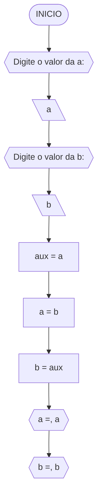
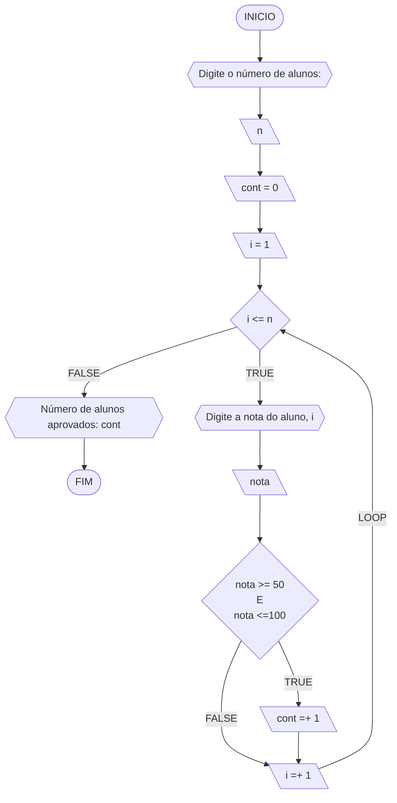
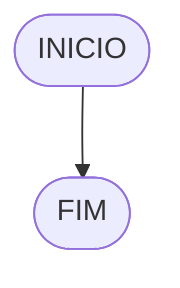

**Curso:** Engenharia da Computação <br>
**Disciplina:** Raciocínio Logico e algoritmo <br>
**Código/Turma:** preencha com seus dados <br>
**Professor:** Ricardo Carubbi <br>
**Data:** preencha com a data de envio <br>
**Aluno(a):** Carlyle Martins <br>
**Matrícula:** 2410305 <br>

**1a chamada (Sim/Não):** sim <br>
**2a chamada (Sim/Não):** preencha com a opção correta

# Avaliação Diagnóstica 1

## Normas e exigências

Avaliação diagnóstica (**AD**) consiste em exercícios ou projetos desenvolvidos em grupo ao longo da disciplina. <br>
A primeira avaliação diagnóstica (**AD1**) será composta por exercícios e equivale a 30% da nota da primeira avaliação (**AV1**).

Segue abaixo a expressão para o cálculo da **AV1**, sendo sendo **AF1** equivale a primeira avaliação formativa e **AD1**, a primeira avaliação diagnóstica.

$$AV_1 = AF_1 \times 0,30 + AD_1 \times 0,70$$

A **AD1** é formada pela entrega dos exercícios (**EX1**) na data prevista e apresentação (**AP1**) de um dos exercícios escolhido pelo professor.
Segue abaixo a expressão para o cálculo da **AD1**.

$$AD_1 = (EX1_1 + AP_1)/2 $$

A **EX1** é avaliada mediante a **correção dos exercícios**, sendo a avaliação no intervalo de 0% (não atende a questão), 50% (atende parcialmente) e 100% (atende em sua totalidade).
Por exemplo, se o exercício equivale a 2 pontos e sua correção atente parcialmente a questão, então sua avaliação deste exercício será 1 ponto.

A **AP1** é avaliada mediante aos pré-requisitos de **clareza, organização e domínio do conteúdo**. Portanto, o aluno deve demonstrar um bom entendimento do algoritmo, explicando seus princípios fundamentais, seu propósito e como ele funciona passo a passo. <br>

A avaliação da **AP1** é apenas considerada no intervalo de 0% (não atende os pré-requisitos), 50% (atende parcialmente) e 100% (atende em sua totalidade).
Por exemplo, se na apresentação do exercício, o aluno atenter parcialmente os pré-requisitos, então sua avaliação da apresentação será 5,0.

## Datas
- Entrega da primeira avaliação formativa (**AF1**) composta pelas listas de exerciícios 1, 2 e 3: 21/03/24
- Entrega dos exercícios da primeira avaliação diagnóstica (**EX1**): 21/03/24
- Apresentação da primeira avaliação diagnóstica (**AP1**): 21/03/24

## Lista de questões

### Questão 1 - Troca dos valores de duas variáveis (1 ponto)

Dadas duas variáveis, $a$ e $b$, implemente e teste um algoritmo para trocar os valores atribuídos a elas.
#### Fluxograma (0.25 ponto)




#### Pseudocódigo (0.5 ponto)

```
Algoritmo TrocaValores
DECLARE a,b 
ESCREVA "Digite o valor da a"
LEIA a
ESCREVA "Digite o valor da b"
LEIA b
aux <- a
a <- b
aux <- b
ESCREVA "a =", a
ESCREVA "b =", b
```

#### Teste de mesa (0.25 ponto)

| nome_coluna1 | nome_coluna2 | nome_coluna3 | nome_coluna4 | nome_coluna5 | 
|      --      |      --      |      --      |      --      |      --      | 
| Adicione     | espaço       | se quiser    |  alinhar     | as barras    |   
| verticais,   | mas          | não é        | obrigatório. | Entendido ?  |

### Questão 2 - Contagem (1 ponto)

Dado um conjunto $n$ de notas de alunos em um exame, implemente e teste um algoritmo para fazer uma contagem $cont$ do número de alunos que foram aprovados no exame. 
Será considerado aprovado o aluno que tirar $nota$ 50 ou maior (no intervalo de 0 a 100).

#### Fluxograma (0.25 ponto)



#### Pseudocódigo (0.5 ponto)

```
Algoritmo ContaAprovacoes
DECLARE n,nota,cont,i : REAIS
INICIO
ESCREVA "Digite o numero de alunos :"
LEIA n
cont = 0
i = 1
ENQUANTO i <= n FAÇA
ESCREVA "Digite a nota do aluno :", i
LEIA nota
SE nota >= 5- e nota <= 100 ENTAO
 cont = +1
FIM ENQUANTO
SENAO
ESCREVA "Numero de alunos aprovados :", cont
FIM


```

#### Teste de mesa (0.25 ponto)

| nome_coluna1 | nome_coluna2 | nome_coluna3 | nome_coluna4 | nome_coluna5 | 
|      --      |      --      |      --      |      --      |      --      | 
| Adicione     | espaço       | se quiser    |  alinhar     | as barras    |
| verticais,   | mas          | não é        | obrigatório. | Entendido ?  |

### Questão 3 - Soma de um conjunto de números (1 ponto)

Dado um conjunto de $n$ números, implemente e teste um algoritmo para calcular a soma desses números. <br>
Aceite apenas $n$ maior ou igual a zero.

#### Fluxograma (0.25 ponto)


#### Pseudocódigo (0.5 ponto)

```
Algoritmo ContaAprovacoes
INICIO
DECLARE n,num,soma
ESCREVA "Digite a quantidade de números (n>=):"
SE n >= 0 ENTAO
soma = 0
i=0
SENAO
ESCREVA "O valor deve ser maior ou igual a zero"
ENQUANTO i <= n FAÇA
ESCREVA "Digite um número:"
soma =+ num
i= +1
SENAO
ESCREVA "A soma dos numeros é, soma"
FIM

```

#### Teste de mesa (0.25 ponto)

| nome_coluna1 | nome_coluna2 | nome_coluna3 | nome_coluna4 | nome_coluna5 | 
|      --      |      --      |      --      |      --      |      --      | 
| Adicione     | espaço       | se quiser    |  alinhar     | as barras    |
| verticais,   | mas          | não é        | obrigatório. | Entendido ?  |

### Questão 4 - Cálculo de uma série (1 ponto)

Dado um conjunto de $n$ termos da série, implemente e teste um algoritmo para calcular o valor de S, conforme definido abaixo:

$$ S = \frac{1}{2} + \frac{3}{4} + \frac{5}{6} + \frac{7}{8} + \dots $$

#### Fluxograma (0.25 ponto)


#### Pseudocódigo (0.5 ponto)

```
ALGORITMO TERMOS
DECLARE n,s,i,numerador,denominador,termo
S = 0
PARA i DE 0 ATÉ n  PASSO 1 FAÇA
numerador = 2 * i + 1
denominador = 2 * i + 2
termo = numerador / denominador
S + = termo
FIM_PARA
ESCREVA "Soma da série S é," S
FIM

```

#### Teste de mesa (0.25 ponto)

| nome_coluna1 | nome_coluna2 | nome_coluna3 | nome_coluna4 | nome_coluna5 | 
|      --      |      --      |      --      |      --      |      --      | 
| Adicione     | espaço       | se quiser    |  alinhar     | as barras    |
| verticais,   | mas          | não é        | obrigatório. | Entendido ?  |

### Questão 5 - Cálculo fatorial (2 pontos)

Dado um número $n$, implemente e teste um algoritmo para calcular o fatorial de $n$ (escrito como $n!$), onde $n ≥ 0$.

#### Fluxograma (0.5 ponto)



#### Pseudocódigo (1.0 ponto)

```
ALGORITMO FATORIAL
DECLARE n,fator,i
INICIO
SE n>= 0 ENTÃO
fator = 1
PARA i DE 1 ATÉ n PASSO 1 FAÇA
fator = fator * i
FIM_PARA
ESCREVA "O fatorial de, n, é:", fator
SENAO
ESCREVA "O valor deve ser maior ou igual a zero"
FIM
```

#### Teste de mesa (0.5 ponto)

| nome_coluna1 | nome_coluna2 | nome_coluna3 | nome_coluna4 | nome_coluna5 | 
|      --      |      --      |      --      |      --      |      --      | 
| Adicione     | espaço       | se quiser    |  alinhar     | as barras    |
| verticais,   | mas          | não é        | obrigatório. | Entendido ?  |

### Questão 6 - Geração da sequência de Fibonacci (2 pontos)

Gerar e imprimir os $n$ primeiros termos da sequência de Fibonacci, onde $n ≥ 1$. <br>
Os primeiros termos são: $0, 1, 1, 2, 3, 5, 8, 13, \dots$ <br>
Cada termo, além dos dois primeiros, é derivado da soma dos seus dois antecessores mais próximos.

#### Fluxograma (0.5 ponto)


#### Pseudocódigo (1.0 ponto)

```
Algoritmo ContaAprovacoes
DECLARE a,b,i,n,termo_atual
INICIO
ESCREVA "Número de termos da série de Fibonacci"
PARA i DE 1 ATÉ n PASSO 1 FAÇA
termo_atual = a + b
a = b
b = termo_atual
FIM_PARA
FIM

```
#### Teste de mesa (0.5 ponto)

| nome_coluna1 | nome_coluna2 | nome_coluna3 | nome_coluna4 | nome_coluna5 | 
|      --      |      --      |      --      |      --      |      --      | 
| Adicione     | espaço       | se quiser    |  alinhar     | as barras    |
| verticais,   | mas          | não é        | obrigatório. | Entendido ?  |

### Questão 7 - Inversão dos dígitos de um número inteiro (2 pontos)

Implemente e teste um algoritmo para inverter a ordem dos dígitos de um número inteiro positivo de dois dígitos.

#### Fluxograma (0.5 ponto)


#### Pseudocódigo (1.0 ponto)

```
Algoritmo ContaAprovacoes
DECLARE num,num_inv,digito,numero
ESCREVA "Digite um número inteiro:"
LEIA num
SE num >= 0 ENTAO
num_inv = 0
 ENQUANTO num = 0 FAÇA
 digito = numero % 10
 num_inv = num_inv * 10 + digito
 numero = numero / 10
  FIM_ENQUANTO
ESCREVA "Numero invertido, num_inv"
SENAO
 ESCREVA "O numero deve ser positivo"
FIM_SE
FIM
```

#### Teste de mesa (0.5 ponto)

| nome_coluna1 | nome_coluna2 | nome_coluna3 | nome_coluna4 | nome_coluna5 | 
|      --      |      --      |      --      |      --      |      --      | 
| Adicione     | espaço       | se quiser    |  alinhar     | as barras    |
| verticais,   | mas          | não é        | obrigatório. | Entendido ?  |
