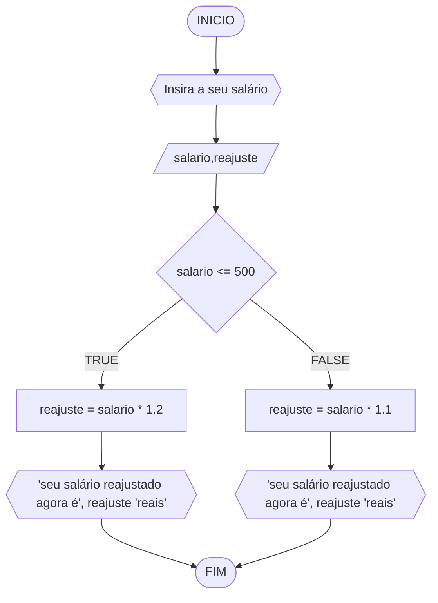
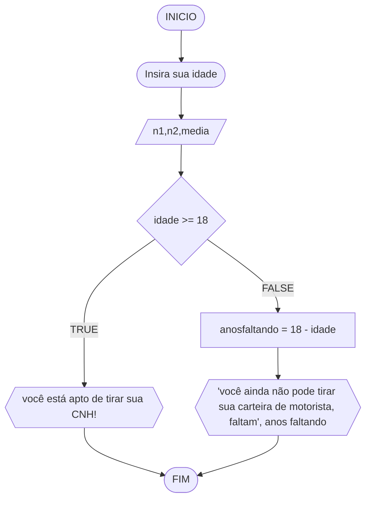

# UNIFOR
**Nome**: Carlyle Martins <br>
**Disciplina**: Raciocínio lógico algorítmico

## Lista de exercícios 01

### Exercício 01 (1 ponto)
Represente, em fluxograma e pseudocódigo, um algoritmo para determinar se um número inteiro e positivo é par ou impar.

#### Fluxograma (0,25 ponto)


#### Pseudocódigo (0,5 ponto)
```
ALGORTIMO verifica_par_impar
DECLARE numero, resto: INTEIRO

INICIO

   ESCREVA "Digite um número: "
   LEIA numero  

   // verifica se o inteiro é positivo
   SE numero >= 0 ENTAO                 
      resto = numero % 2                 

      // calcula o resto da divisão por 2
      SE resto == 0 ENTAO               
        ESCREVA "O número é par!"        
       // verifica se o resto é igual a zero
      SENAO
        ESCREVA "O número é impar!"

      FIM_SE
   // caso inteiro for negativo 
   SENAO                               
     ESCREVA "O número deve ser postivo!"

   FIM_SE
FIM
```

#### Teste de mesa (0,25 ponto)
| numero | numero >= 0 | resto | resto == 0 | Saída |
| -- | -- | -- | -- | -- | 
| -1 | F |   |   | "O número deve ser postivo!" |
| 0  | V | 0 | V | "O número é par!" |
| 13 | V | 1 | F | "O número é impar!" |
| 30 | V | 0 | V | "O número é par!" |

## Exercício 02 (3 pontos)
Represente, em fluxograma e pseudocódigo, um algoritmo para calcular o novo salário de um funcionário. 
Sabe-se que os funcionários que recebem atualmente salário de até R$ 500 terão aumento de 20%; os demais terão aumento de 10%.

#### Fluxograma (1.0 ponto)



#### Pseudocódigo (1.0 ponto)

```
ALGORITMO SALARIO
DECLARE salario, reajuste

INICIO

  // primeiro input para a análise do salário
  ESCREVA "Insira o seu salário" 
  LEIA salario

  // checagem do valor, caso ele tenha os requisitos abaixo, terá um aumento de 20% no salário
  SE salario <= 500 ENTAO       
    reajuste <- salario * *1.2
    ESCREVA "seu salário reajustado agora é", reajuste "reais"  // saída (aonde o usuário vê o reajuste do salário no primeiro caso)

  // caso ele não se enquadre na condição acima, terá o desconto de 10% no salário
  SENAO
    reajuste <- salario * *1.1             
    ESCREVA "seu salário reajustado agora é", reajuste "reais" // saída ( aonde o usuário vê o reajuste do salário no segundo caso)

   FIM_SE
FIM
```

#### Teste de mesa (1.0 ponto)

|salario| salario <= 500 | reajuste | saída |
|      --      |      --      |      --      |   --    |
| 450     | TRUE       | se quiser    |  seu salário reajustado agora é, 540 reais      |
| 800   | FALSE          | não é        |   seu salário reajustado agora é, 880 reais      |

## Exercício 03 (3 pontos)
Represente, em fluxograma e pseudocódigo, um algoritmo para calcular a média aritmética entre duas notas de um aluno e mostrar sua situação, que pode ser aprovado ou reprovado.

#### Fluxograma (1 ponto)


#### Pseudocódigo (1 ponto)

```
ALGORITMO MEDIA
DECLARE n1,n2,media : INTEIRO

INICIO

  // primeiro input do código
  ESCREVA "Insira a primeira nota" 
  LEIA n1

  // segundo input do código
  ESCREVA "Insira a segunda nota"   
  LEIA n2

  // para poder selecionar qual média deseja inserir, pois nem todas são iguais 
  ESCREVA "Insira a média"          
  LEIA media

  // cálculo utilizando os valóres inseridos pelo usuário 
  SE media >= (n1+n2)/2 ENTAO       
    ESCREVA "você está aprovado!"   // resultado caso dê True (ele esteja na média inserida pelo mesmo)

  SENAO
    ESCREVA "você está reprovado"   // resultado caso dê False (em que ele não se encaixa na média colocada)
  FIM_SE
FIM
```

#### Teste de mesa (1 ponto)

| n1 | n2 | media | SAIDA | 
|      --      |      --      |      --      |      --      |
| 5     | 9     | 7    |  você está aprovado!  |
| 2   |    6        | 8        |você está reprovado |
|      9      |      10      |      8      |    você está aprovado!     |
|     8      |      5      |      7      |     você está reprovado     |


## Exercício 04 (3 pontos)
Represente, em fluxograma e pseudocódigo, um algoritmo que, a partir da idade do candidato(a), determinar se pode ou não tirar a CNH. 
Caso não atender a restrição de idade, calcular quantos anos faltam para o candidato estar apto.

#### Fluxograma (1.0 ponto)




#### Pseudocódigo (1.0 ponto)

```
ALGORITMOCNH
DECLARE idade, anosfaltando

INICIO

  // primeira interação do usuário para dar início ao algorítmo 
  ESCREVA "Insira sua idade" 
  LEIA idade

  // para garantir que o número não seja negativo
  SE idade < 0  ENTAO        
    ESCREVA "Insira uma idade positiva"
  SENAO  

    // caso não seja negativo, haverá checagem para saber o resultado do participante 
    SE idade >= 18 ENTAO       
      ESCREVA "você está apto de tirar sua CNH!"

    // caso contrário, calculamos quantos anos faltam para ele poder tirar sua carteira 
    SENAO                      
      anosfaltando <- (18 - idade) 
      ESCREVA "você ainda não pode tirar sua carteira de motorista, faltam", anosfaltando "anos"

    FIM_SE

  FIM_SE

FIM

```

#### Teste de mesa (1.0 ponto)

| idade | idade >= 18 | anosfaltando | SAIDA | 
|      --      |      --      |      --      |      --      |
| 15     | FALSE       | 3    |  Você ainda não pode tirar sua carteira de motorista, faltam, 3 anos   |
| 26   | TRUE          | -8        |você está apto de tirar sua CNH!|
|      32      |      TRUE      |      -14      |     você está apto de tirar sua CNH!      |
|      18      |      TRUE      |      0      |      você está apto de tirar sua CNH!      |
