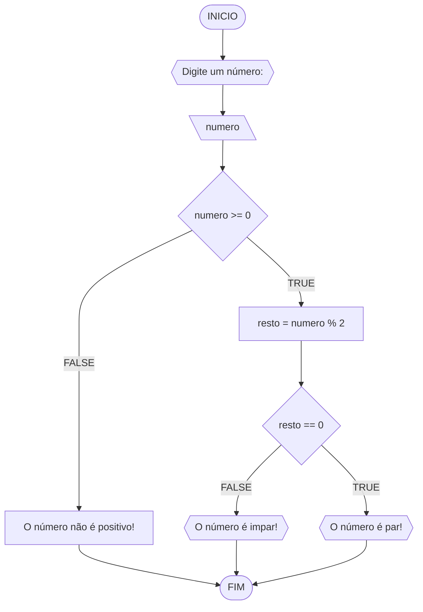
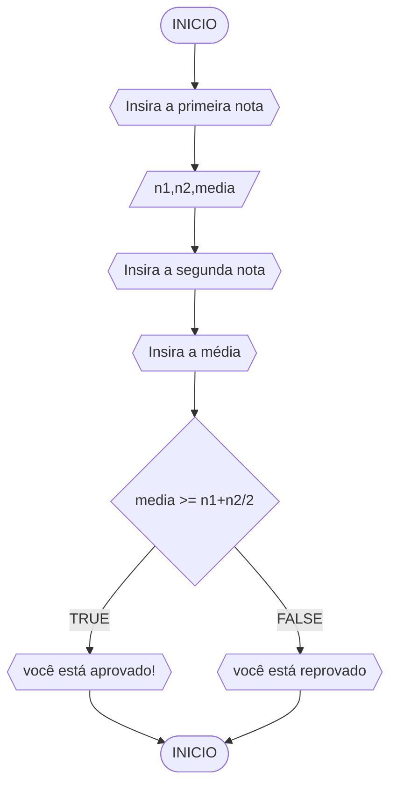

# UNIFOR
**Nome**: Nome do estudante <br>
**Disciplina**: Raciocínio lógico algorítmico

## Lista de exercícios 01

### Exercício 01 (1 ponto)
Represente, em fluxograma e pseudocódigo, um algoritmo para determinar se um número inteiro e positivo é par ou impar.

#### Fluxograma (0,25 ponto)



#### Pseudocódigo (0,5 ponto)
```
1  ALGORTIMO verifica_par_impar
2  DECLARE numero, resto: INTEIRO
3  ESCREVA "Digite um número: "
4  INICIO
4  LEIA numero
5  SE numero >= 0 ENTAO                  // verifica se o inteiro é positivo
6    resto = numero % 2                 // calcula o resto da divisão por 2
7    SE resto == 0 ENTAO                // verifica se o resto é igual a zero
8      ESCREVA "O número é par!"
9    SENAO
10     ESCREVA "O número é impar!"
11   FIM_SE
11  SENAO                                // caso inteiro for negativo (condição linha 5)
12    ESCREVA "O número deve ser postivo!"
13  FIM_SE
13 FIM
```

#### Teste de mesa (0,25 ponto)
| numero | numero >= 0 | resto | resto == 0 | Saída |
| -- | -- | -- | -- | -- | 
| -1 | F |   |   | "O número deve ser postivo!" |
| 0  | V | 0 | V | "O número é par!" |
| 13 | V | 1 | F | "O número é impar!" |
| 30 | V | 0 | V | "O número é par!" |

## Exercício 02 (3 pontos)
Represente, em fluxograma e pseudocódigo, um algoritmo para calcular o novo salário de um funcionário. 
Sabe-se que os funcionários que recebem atualmente salário de até R$ 500 terão aumento de 20%; os demais terão aumento de 10%.

#### Fluxograma (1.0 ponto)


#### Pseudocódigo (1.0 ponto)

```
ALGORITMO SALARIO
DECLARE salario, reajuste
INICIO
ESCREVA "Insira o seu salário"
LEIA salario
SE salario <= 500 ENTAO
reajuste <- salario * *1.2
ESCREVA "seu salário reajustado agora é", reajuste "reais"
SENAO
reajuste <- salario * *1.1
ESCREVA "seu salário reajustado agora é", reajuste "reais"
FIM
```

#### Teste de mesa (1.0 ponto)

|salario| salario <= 500 | reajuste | saída |
|      --      |      --      |      --      |   --    |
| 450     | TRUE       | se quiser    |  seu salário reajustado agora é, 540 reais      |
| 800   | FALSE          | não é        |   seu salário reajustado agora é, 880 reais      |

## Exercício 03 (3 pontos)
Represente, em fluxograma e pseudocódigo, um algoritmo para calcular a média aritmética entre duas notas de um aluno e mostrar sua situação, que pode ser aprovado ou reprovado.

#### Fluxograma (1 ponto)



#### Pseudocódigo (1 ponto)

```
ALGORITMO MEDIA
DECLARE n1,n2,media : INTEIRO
INICIO
ESCREVA "Insira a primeira nota"
LEIA n1
ESCREVA "Insira a segunda nota"
LEIA n2
ESCREVA "Insira a média"
LEIA media
SE media >= (n1+n2)/2 ENTAO
ESCREVA "você está aprovado!"
SENAO
ESCREVA "você está reprovado"
FIM
```

#### Teste de mesa (1 ponto)

| n1 | n2 | media | SAIDA | 
|      --      |      --      |      --      |      --      |
| 5     | 9     | 7    |  você está aprovado!  |
| 2   |    6        | 8        |você está reprovado |
|      9      |      10      |      8      |    você está aprovado!     |
|     8      |      5      |      7      |     você está reprovado     |


## Exercício 04 (3 pontos)
Represente, em fluxograma e pseudocódigo, um algoritmo que, a partir da idade do candidato(a), determinar se pode ou não tirar a CNH. 
Caso não atender a restrição de idade, calcular quantos anos faltam para o candidato estar apto.

#### Fluxograma (1.0 ponto)


#### Pseudocódigo (1.0 ponto)

```
ALGORITMOCNH
DECLARE idade, anosfaltando
INICIO
ESCREVA "Insira sua idade"
LEIA idade
SE idade >= 18 ENTÃO
ESCREVA "você está apto de tirar sua CNH!"
SENAO
anosfaltando <- (18 - idade)
ESCREVA "você ainda não pode tirar sua carteira de motorista, faltam", anosfaltando "anos"
FIM

```

#### Teste de mesa (1.0 ponto)

| idade | idade >= 18 | anosfaltando | SAIDA | 
|      --      |      --      |      --      |      --      |
| 15     | FALSE       | 3    |  Você ainda não pode tirar sua carteira de motorista, faltam, 3 anos   |
| 26   | TRUE          | -8        |você está apto de tirar sua CNH!|
|      32      |      TRUE      |      -14      |     você está apto de tirar sua CNH!      |
|      18      |      TRUE      |      0      |      você está apto de tirar sua CNH!      |
