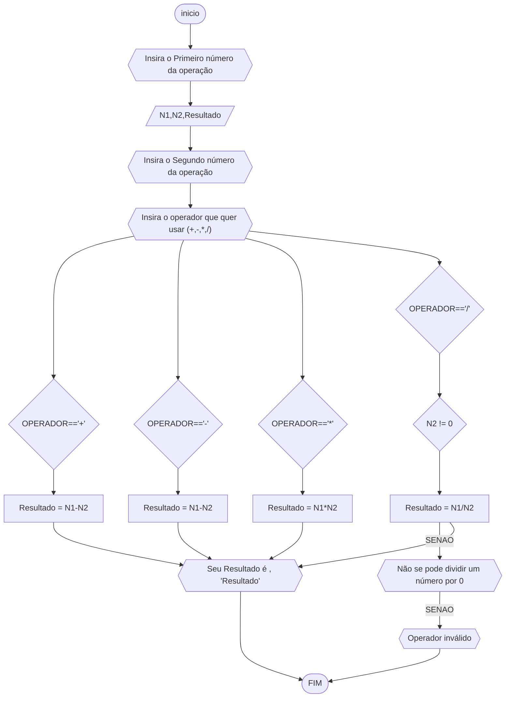
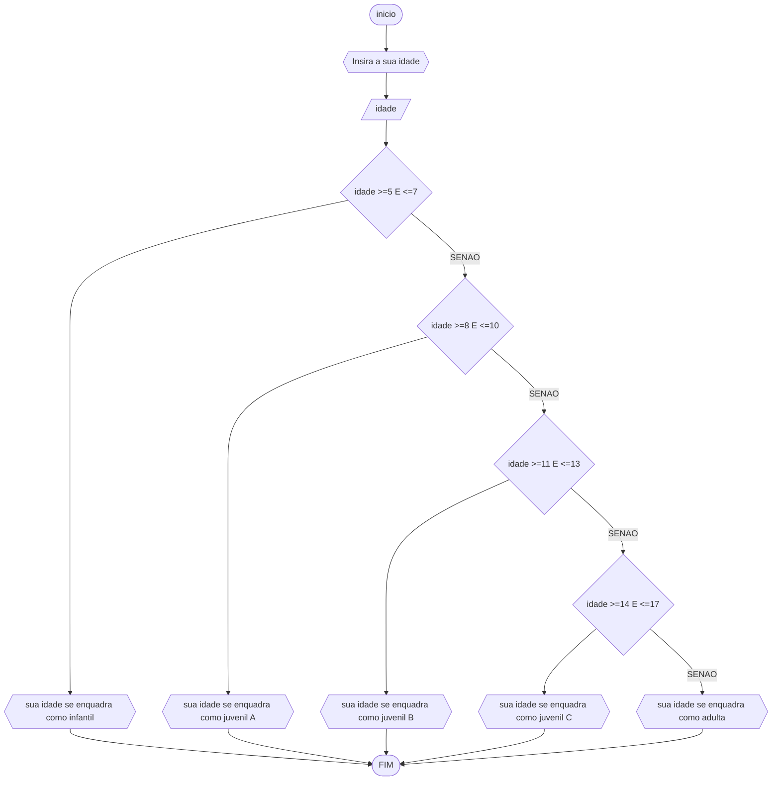

# UNIFOR
**Nome**: Carlyle Martins<br>
**Disciplina**: Raciocínio lógico algorítm

## Exercício exemplo
Represente, em fluxograma e pseudocódigo, um algoritmo para calcular o adicional de salário de funcionário por cargo de uma empresa fictícia. Sabe-se que os funcionários de cargo técnico receberão reajuste de 50%, cargo de gerência, um reajuste de 30% e demais, um reajuste de 10%. 

#### Fluxograma


#### Pseudocódigo
```
1  ALGORITMO calReajuste
2  DECLARE  sal, sal_reaj: real, prof: caractere
3  INICIO
4  LEIA sal, prof
5  ESCOLHA
6   CASO prof == “Técnico”		// caso 1
7     sal_reaj ← 1.5 * sal
8   CASO prof = “Gerente”		// caso 2
9     sal_reaj ← 1.3 * sal
10  SENÃO
11    sal_reaj ← 1.1 * sal
12 FIM_ESCOLHA
13 ESCREVA “Salário Reajustado = “, sal_reaj
14 FIM
```

#### Teste
| sal | prof | prof == “Técnico” | prof = “Gerente” | sal_reaj | Saída |
| -- | -- | -- | -- | -- | -- |
| 1000 | Técnico | V | F | 1500 | “Salário Reajustado = 1500“ |
| 2000 | Gerente | F | V | 2600 | “Salário Reajustado = 2600“ |
| 9000 | Diretor | F | F | 9900 | “Salário Reajustado = 9900“ |

## Lista de exercícios 02

### Exercício 01 (2.5 pontos)
Calcule a média de quatro números inteiros dados.

#### Fluxograma (1.0 ponto)


#### Pseudocódigo (1.0 ponto)

```
1  ALGORITMO Média
2  DECLARE N1,N2,N3,N4, média : INTEIRO
3  INICIO
4 ESCREVA " Digite os 4 números que quer a média"
5 LEIA N1 e N2 e N3 e N4
6  Média=(Numero1+Numero2+Numero3+Numero4)/4
7 ESCREVA "Sua média é 'Média'"
15 FIM
```

#### Teste de mesa (0.5 ponto)

#### Teste de mesa (0,25 ponto)
| N1 | N2 |  N3 |  N4 | Média | Saída |
| -- | -- | -- | -- | -- | -- |
| 10 | 20 | 30  | 40  | 25 |  "Sua Média é 25"
| -5 | 15 | 25 | 35 | 15 |  "Sua Média é 25"
| 0 | 0 | 0 | 0 | 0 |  "Sua Média é 25"
| 5 | -10 | 15 | -20 | -2.5 |  "Sua Média é 25"

### Exercício 02 (2.5 pontos)
Leia uma temperatura dada em Celsius (C) e imprima o equivalente em Fahrenheit (F). (Fórmula de conversão: F = (9/5) * C + 32)

#### Fluxograma (1.0 ponto)


#### Pseudocódigo (1.0 ponto)

```
#### Pseudocódigo
```
1  ALGORITMO Farenheight
2  DECLARE C,F : Real
3  INICIO
4 ESCREVA "Insira quantos graus Celsius você quer converter"
5 LEIA C
6  F <- (9/5) * C + 32
7 ESCREVA "A conversão de ", C, " graus Celsius para 
8 Fahrenheit é ", F, " graus Fahrenheit"
9 FIM
```
```

#### Teste de mesa (0.5 ponto)

| C | Processamento |  Saída |
| -- | -- | -- |
| 10 | F = (9/5)*C+32 | "A conversão de 30 graus Celsius para Fahrenheit é 86 graus Fahrenheit" |
| 0 | F = (9/5)*C+32| "A conversão de 0 graus Celsius para Fahrenheit é 32 graus Fahrenheit"| 
| -10 | F = (9/5)*C+32 |"A conversão de -10 graus Celsius para Fahrenheit é 14 graus Fahrenheit"| 
| 100 | F = (9/5)*C+32| "A conversão de 100 graus Celsius para Fahrenheit é 212 graus Fahrenheit"| |

### Exercício 03 (2.5 pontos)
Receba dois números reais e um operador e efetue a operação correspondente com os valores recebidos (operandos). 
O algoritmo deve retornar o resultado da operação selecionada simulando todas as operações de uma calculadora simples.

#### Fluxograma (1.0 ponto)



#### Pseudocódigo (1.0 ponto)

```
1  ALGORITMO Operações Matemáticas
2  DECLARE N1,N2,Resultado : REAL
	OPERADOR : CARACTER
3  INICIO
4 ESCREVA "Insira o Primeiro número da operação"
5 LEIA N1 
6 ESCREVA "Insira o Segundo número da operação"
7 LEIA N2
6 ESCREVA "Insira o operador que quer usar (+,-,*,/)"
7 Leia OPERADOR	
8 Se OPERADOR == "+"ENTAO
9 Resultado <- N1+N2
10 SENAO SE OPERADOR == "-" ENTAO
11 Resultado <- N1-N2
12 SENAO SE OPERADOR == "*" ENTAO
13 Resultado <- N1*N2
14 SENAO SE OPERADOR == "/" ENTAO
15 SE N2 !=0 ENTAO 
16 Resultado <- N1/N2
17 SENAO
18 ESCREVA "Não se pode dividir um número por 0"
19 SENAO
20	 ESCREVA "Operador Inválido"
21 FIM SE
22 SE OPERADOR == "+" OU OPERADOR == "-" OU OPERADOR == "*" OU OPERADOR == "/" ENTAO
23 ESCREVA "Seu Resultado é ", Resultado
24 FIM SE
25 FIM
```

#### Teste de mesa (0.5 ponto)

| Iteração | N1  | N2  | OPERADOR | Resultado | Saída                   |
|----------|-----|-----|----------|-----------|-----------------------------------|
| 1        | 5   | 3   | "+"      | 8         | "Seu Resultado é 8"               |
| 2        | 10  | 5   | "-"      | 5         | "Seu Resultado é 5"               |
| 3        | 7   | 4   | "*"      | 28        | "Seu Resultado é 28"              |
| 4        | 15  | 0   | "/"      | Não definido | "Não se pode dividir um número por 0" |

### Exercício 04 (2.5 pontos)
Elaborar um algoritmo que, dada a idade, classifique nas categorias: infantil A (5 - 7 anos), infantil B (8 -10 anos), juvenil A (11 - 13 anos), juvenil B (14 -17 anos) e adulto (maiores que 18 anos).

#### Fluxograma (1.0 ponto)



#### Pseudocódigo (1.0 ponto)

```
Algotimo IDADE
DECLARE idade : INTEIRO
ESCREVA "Insira a sua idade"
LEIA idade
SE idade >=5 E <=7 ENTAO
ESCREVA "sua idade se enquadra como infantil"
SENAO SE idade >=8 E <=10 ENTAO
ESCREVA "sua idade se enquadra como juvenil A"
SENAO SE idade >=11 E <=13 ENTAO
ESCREVA "sua idade se enquadra como juvenil B"
SENAO SE idade >=14 E <=17 ENTAO
ESCREVA "sua idade se enquadra como juvenil C"
SENAO 
ESCREVA "sua idade se enquadra como adulto"
FIM SE 
FIM
```

#### Teste de mesa (0.5 ponto)

| Iteração | idade | Saída | 
| -- | -- | -- | 
| 1  | 6 | "sua idade se enquadra como infantil"  |
| 2  | 9 | "sua idade se enquadra como juvenil A" |
| 3  | 16 | "sua idade se enquadra como juvenil C" |
| 4  | 21 | "sua idade se enquadra como adulta" |
