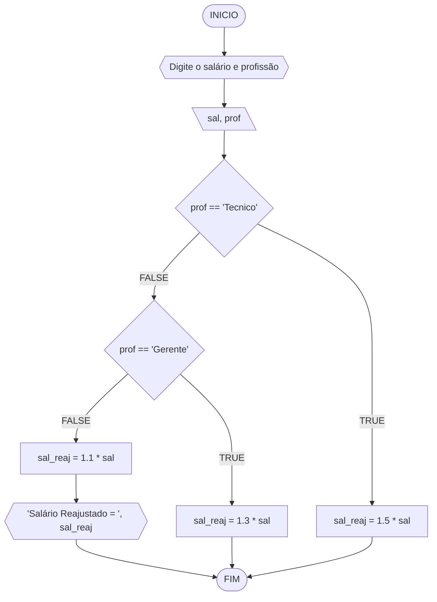
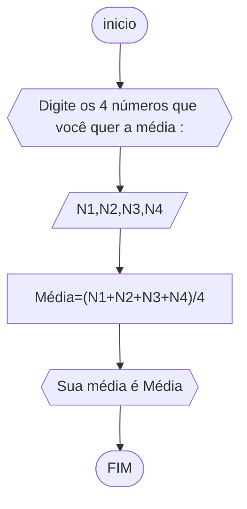
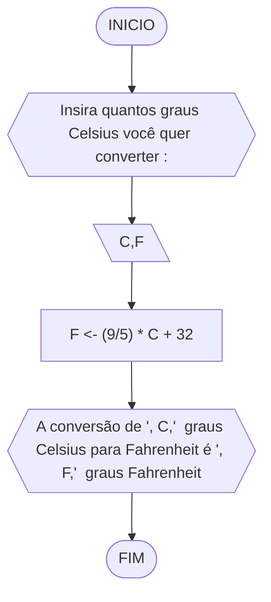
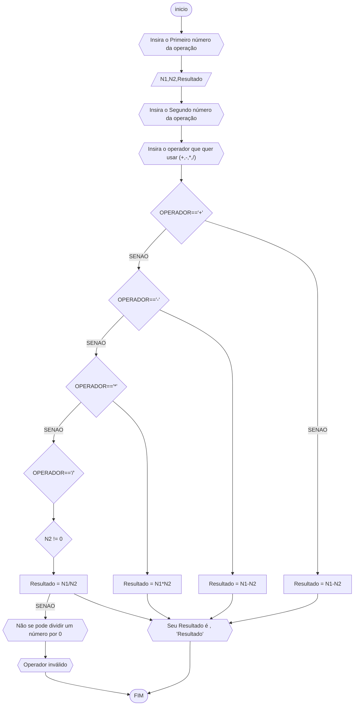
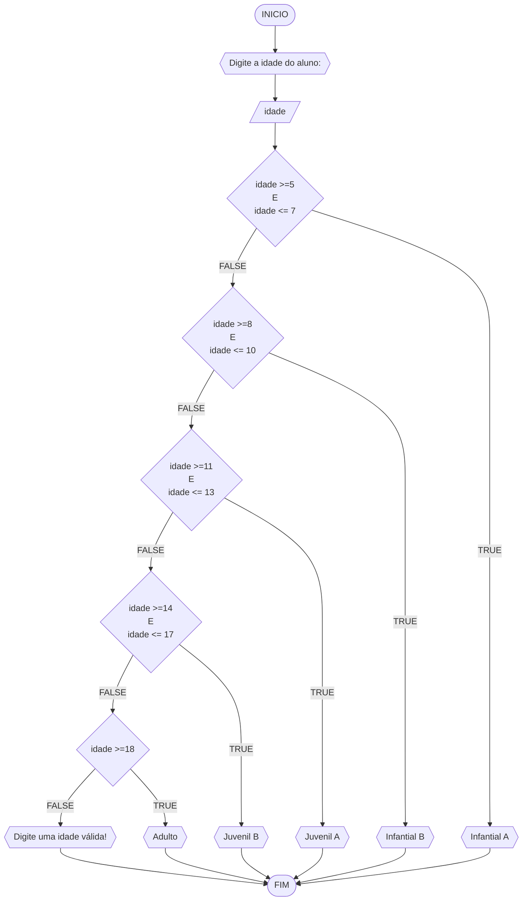

# UNIFOR
**Nome**: Carlyle Martins<br>
**Disciplina**: Raciocínio lógico algorítmo

## Exercício exemplo
Represente, em fluxograma e pseudocódigo, um algoritmo para calcular o adicional de salário de funcionário por cargo de uma empresa fictícia. Sabe-se que os funcionários de cargo técnico receberão reajuste de 50%, cargo de gerência, um reajuste de 30% e demais, um reajuste de 10%. 

#### Fluxograma


#### Pseudocódigo
```
  ALGORITMO calReajuste
  DECLARE  sal, sal_reaj: real, prof: caractere

  INICIO

	LEIA sal, prof
	ESCOLHA

		// caso ele seja um Técnico, terá o salário aumentado em 50%
		CASO prof == “Técnico”		
			sal_reaj ← 1.5 * sal

		// caso ele seja Gerente, terá o salário aumentado em 30%
		CASO prof = “Gerente”		
     			sal_reaj ← 1.3 * sal

	// se a escolha não corresponder a nenhum dos dois casos, o funcionário terá um aumento de 10%
	SENÃO
           sal_reaj ← 1.1 * sal

	FIM_ESCOLHA

	// saída (ainda o funcionário verá o reajuste de seu salário)
 	ESCREVA “Salário Reajustado = “, sal_reaj

  FIM
```

#### Teste
| sal | prof | prof == “Técnico” | prof = “Gerente” | sal_reaj | Saída |
| -- | -- | -- | -- | -- | -- |
| 1000 | Técnico | V | F | 1500 | “Salário Reajustado = 1500“ |
| 2000 | Gerente | F | V | 2600 | “Salário Reajustado = 2600“ |
| 9000 | Diretor | F | F | 9900 | “Salário Reajustado = 9900“ |

## Lista de exercícios 02

### Exercício 01 (2.5 pontos)
Calcule a média de quatro números inteiros dados.

#### Fluxograma (1.0 ponto)



#### Pseudocódigo (1.0 ponto)

```
ALGORITMO Média
DECLARE N1,N2,N3,N4, média : INTEIRO

INICIO
	// registro do primeiro número
	ESCREVA " Digite o número 1 :"
	LEIA N1

	// registro do primeiro número
	ESCREVA " Digite o número 2 :"
	LEIA N2

	// registro do primeiro número
	ESCREVA " Digite o número 3 :"
	LEIA N3

	// registro do primeiro número
	ESCREVA " Digite o número 4 :"
	LEIA N4 

	// cálculo da média dos números registrados anteriormente
	Média=(Numero1+Numero2+Numero3+Numero4)/4
	ESCREVA "Sua média é 'Média'"
FIM
```

#### Teste de mesa (0.5 ponto)

#### Teste de mesa (0,25 ponto)
| N1 | N2 |  N3 |  N4 | Média | Saída |
| -- | -- | -- | -- | -- | -- |
| 10 | 20 | 30  | 40  | 25 |  "Sua Média é 25"
| -5 | 15 | 25 | 35 | 15 |  "Sua Média é 25"
| 0 | 0 | 0 | 0 | 0 |  "Sua Média é 25"
| 5 | -10 | 15 | -20 | -2.5 |  "Sua Média é 25"

### Exercício 02 (2.5 pontos)
Leia uma temperatura dada em Celsius (C) e imprima o equivalente em Fahrenheit (F). (Fórmula de conversão: F = (9/5) * C + 32)

#### Fluxograma (1.0 ponto)



#### Pseudocódigo (1.0 ponto)

```
ALGORITMO Farenheight
DECLARE C,F : Real

INICIO
	ESCREVA "Insira quantos graus Celsius você quer converter"	// para inserir quantos graus o usuário quer converter
	LEIA C
	F <- (9/5) * C + 32						// cálculo de conversão de celsius para farenheight
	ESCREVA "A conversão de ", C, " graus Celsius para 		// saída (aonde o usuário vai ver o resultado da conversão)
	Fahrenheit é ", F, " graus Fahrenheit"
FIM
```

#### Teste de mesa (0.5 ponto)

| C | Processamento |  Saída |
| -- | -- | -- |
| 10 | F = (9/5)*C+32 | "A conversão de 30 graus Celsius para Fahrenheit é 86 graus Fahrenheit" |
| 0 | F = (9/5)*C+32| "A conversão de 0 graus Celsius para Fahrenheit é 32 graus Fahrenheit"| 
| -10 | F = (9/5)*C+32 |"A conversão de -10 graus Celsius para Fahrenheit é 14 graus Fahrenheit"| 
| 100 | F = (9/5)*C+32| "A conversão de 100 graus Celsius para Fahrenheit é 212 graus Fahrenheit"| |

### Exercício 03 (2.5 pontos)
Receba dois números reais e um operador e efetue a operação correspondente com os valores recebidos (operandos). 
O algoritmo deve retornar o resultado da operação selecionada simulando todas as operações de uma calculadora simples.


#### Fluxograma (1.0 ponto)



#### Pseudocódigo (1.0 ponto)

```
ALGORITMO Operações Matemáticas
DECLARE N1,N2,Resultado : REAL
OPERADOR : CARACTER

INICIO

	// para especificar qual o comando da respectiva operação
	ESCREVA "Operações válidas: 1(soma), 2(subtração), 3(multiplicação), 4(divisão)"

	// selecionando alguma operação indicada
	ESCREVA "Insira a operação que quer usar"
	LEIA OPERADOR

	// Registrando o primeiro número
	ESCREVA "Insira o Primeiro número da operação"
	LEIA N1 

	// Registrando o segundo número
	ESCREVA "Insira o Segundo número da operação"
	LEIA N2	

	// Resultado caso seja uma soma 
	SE OPERADOR == "1" ENTAO
	Resultado <- N1+N2

	// Resultado caso seja uma subtração 
	SENAO SE OPERADOR == "2" ENTAO
	Resultado <- N1-N2

	// Resultado caso seja uma multiplicação  
	SENAO SE OPERADOR == "3" ENTAO
		Resultado <- N1*N2

	// Resultado caso seja uma divisão 
	SENAO SE OPERADOR == "4" ENTAO

		// checagem para garantir que o denominador não seja zero
		SE N2 !=0 ENTAO 

		Resultado <- N1/N2

		// caso seja igual a 0, retornará essa mensagem
		SENAO
		ESCREVA "Não se pode dividir um número por 0"

	// caso não insiram algum operador indicado
	SENAO
	ESCREVA "Operador Inválido"

	FIM_SE

	// saída do resultado para a respectíva operação 
	SE OPERADOR == 1 OU OPERADOR == 2 OU OPERADOR == 3 OU OPERADOR == 4 ENTAO
	ESCREVA "Seu Resultado é ", Resultado

	FIM SE

FIM
```

#### Teste de mesa (0.5 ponto)

| Iteração | N1  | N2  | OPERADOR | Resultado | Saída                   |
|----------|-----|-----|----------|-----------|-----------------------------------|
| 1        | 5   | 3   | "+"      | 8         | "Seu Resultado é 8"               |
| 2        | 10  | 5   | "-"      | 5         | "Seu Resultado é 5"               |
| 3        | 7   | 4   | "*"      | 28        | "Seu Resultado é 28"              |
| 4        | 15  | 0   | "/"      | Não definido | "Não se pode dividir um número por 0" |

### Exercício 04 (2.5 pontos)
Elaborar um algoritmo que, dada a idade, classifique nas categorias: infantil A (5 - 7 anos), infantil B (8 -10 anos), juvenil A (11 - 13 anos), juvenil B (14 -17 anos) e adulto (maiores que 18 anos).

#### Fluxograma (1.0 ponto)



#### Pseudocódigo (1.0 ponto)

```
Algotimo IDADE
DECLARE idade : INTEIRO

INICIO
ALGORTIMO ClassificaCategoria
DECLARE idade: INTEIRO

INICIO

    // Input para receber o dado da idade
    ESCREVA "Digite a idade do aluno:"

    // registrando o dado
    LEIA idade

    // Início de uma estrutura de "casos"
    ESCOLHA

        // caso que se torna verdade se a idade for maior ou igual a 5 e menor ou igual a 7
        CASO idade >=5 E idade <= 7

            // aparecerá que a idade do aluno se enquadra como Infantil A
            ESCREVA "Infantial A"

        // caso que se torna verdade se a idade for maior ou igual a 8 e menor ou igual a 10
        CASO idade >=8 E idade <= 10

            // aparecerá que a idade do alunose enquadra como Infantil B
            ESCREVA "Infantial B"

        // caso que se torna verdade se a idade for maior ou igual a 11 e menor ou igual a 13
        CASO idade >=11 E idade <= 13

            // aparecerá que a idade do aluno se enquadra como Juvenil A
            ESCREVA "Juvenil A"

        // caso que se torna verdade se a idade for maior ou igual a 14 e menor ou igual a 17
        CASO idade >=14 E idade <= 17

            // aparecerá que a idade do aluno se enquadra como Juvenil B
            ESCREVA "Juvenil B"

        // caso que se torna verdade se a idade for maior ou igual a 18
        CASO idade >=18

            // aparecerá que a idade do aluno se enquadra como Adulto
            ESCREVA "Adulto"

    // Insira seu comentário
    SENAO

        // Insira seu comentário
        ESCREVA "Digite uma idade válida!"

    FIM_ESCOLHA

FIM
```

#### Teste de mesa (0.5 ponto)

| Iteração | idade | Saída | 
| -- | -- | -- | 
| 1  | 6 | "sua idade se enquadra como infantil"  |
| 2  | 9 | "sua idade se enquadra como juvenil A" |
| 3  | 16 | "sua idade se enquadra como juvenil C" |
| 4  | 21 | "sua idade se enquadra como adulta" |
